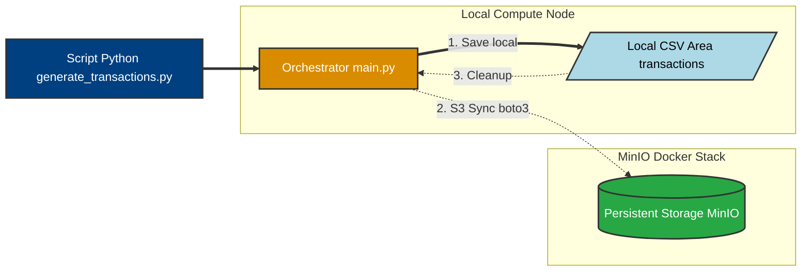
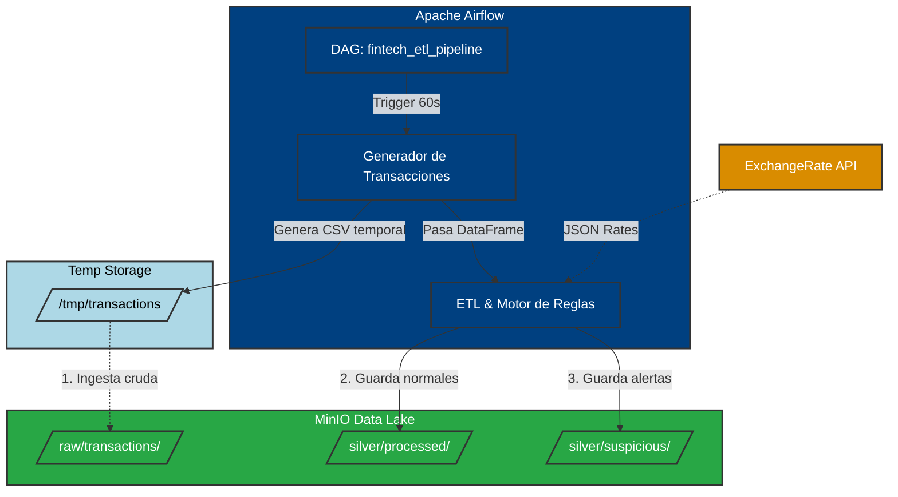

# Fintech Data Pipeline - Technical Challenge

Este proyecto consiste en el diseño e implementación de un sistema de procesamiento de datos end-to-end para una fintech, enfocado en la ingesta, limpieza y detección de anomalías en transacciones financieras.

## Arquitectura de la Fase 1: Data Lake e Ingestión

En esta etapa inicial se ha establecido la infraestructura base, priorizando la escalabilidad y la persistencia de datos mediante un modelo de almacenamiento de objetos.

### Componentes Técnicos
* **Data Lake (MinIO):** Se ha desplegado una instancia de MinIO mediante Docker Compose, proporcionando una capa de almacenamiento persistente compatible con el protocolo S3. Esto asegura la interoperabilidad con servicios de nube como AWS.
* **Patrón Staging & Cleanup:** El pipeline utiliza el sistema de archivos local únicamente como un área de tránsito temporal (*staging*). Una vez confirmada la carga exitosa en el bucket de MinIO, el recurso local es liberado para optimizar el almacenamiento del nodo de cómputo.
* **Procesamiento en Memoria:** Tras la sincronización con el Data Lake, los datos se transfieren directamente como DataFrames de Pandas a las funciones de procesamiento, reduciendo latencias de I/O innecesarias.

---

## Configuración del Entorno

### Requisitos
* Python 3.11+
* Docker y Docker Compose
* Virtualenv

### Instrucciones de Despliegue

1. **Clonar el repositorio:**
   ```bash
   git clone git@github.com:J-Lopez-IICG/Technical-Challenge-JavierLopez
   cd Technical-Challenge-JavierLopez

### Preparar el entorno virtual
* python -m venv venv
* source venv/bin/activate  # En Windows: .\venv\Scripts\activate
* pip install -r requirements.txt

### Iniciar infraestructura
docker-compose up -d
* Consola de Administración http://localhost:9001
* Credenciales por defecto: admin/password123

## Estado de Avance: Fase 1

| Objetivo | Estado | Descripción Técnica | Tiempo Estimado |
| :--- | :--- | :--- | :--- |
| **Ingesta de Datos** | Completado | Generación y lectura de archivos CSV en intervalos de 60s. | 45 min |
| **Integración MinIO** | Completado | Implementación de cliente Boto3 para persistencia en S3. | 1h 15 min |
| **Gestión de Archivos** | Completado | Implementación de limpieza automática de staging local. | 30 min |
| **Infraestructura Docker** | Completado | Orquestación de servicios mediante Docker Compose. | 30 min |

> **Nota sobre el Cronograma:** El tiempo total invertido en la Fase 1 fue de **3 horas**. Este tiempo incluye la configuración del entorno de contenedores, la validación de la conectividad con la API de S3 y la reestructuración del orquestador principal para soportar el procesamiento en memoria.

## Decisiones de Ingeniería y Arquitectura

* **Persistencia Híbrida:** Se implementó un esquema donde los datos aterrizan primero en un `staging` local para asegurar la integridad antes de ser transferidos al Data Lake (MinIO).
* **Eficiencia de Recursos:** El sistema elimina automáticamente los archivos temporales tras una subida exitosa, cumpliendo con las mejores prácticas de gestión de almacenamiento en nodos de cómputo.
* **Agnosticismo de Nube:** Al utilizar el SDK `boto3`, el código es compatible con AWS S3, permitiendo una migración a producción con cambios mínimos en la configuración.

### Flujo de Datos de la Fase 1


## Arquitectura de la Fase 2: ETL, Calidad de Datos y Orquestación

En esta etapa se implementó la lógica de transformación y las reglas de negocio, evolucionando el Data Lake hacia una Arquitectura Medallón y automatizando el flujo de trabajo mediante un orquestador de grado de producción.

### Componentes Técnicos
* **Capa Silver (Limpieza y Tipado):** Implementación de estandarización de formatos, imputación lógica de valores nulos e inferencia de moneda basada en el país de origen. Se estableció un filtro duro para la remoción de outliers técnicos (montos negativos o sistémicamente irreales).
* **Enriquecimiento de Datos:** Integración en tiempo real con *ExchangeRate API* para normalizar los montos de transacciones a dólares estadounidenses (USD), garantizando una base equitativa para la evaluación de riesgos.
* **Motor de Reglas de Fraude:** Desarrollo de una capa analítica que segmenta los datos en flujos normales y sospechosos, evaluando métricas como montos inusualmente altos, múltiples intentos fallidos, violaciones de seguridad y riesgo de transacciones internacionales.
* **Orquestación (Apache Airflow):** Transición de la ejecución manual mediante scripts a un *Directed Acyclic Graph* (DAG) dockerizado. Esto permite la ejecución automatizada, programada y monitoreada del pipeline de forma continua.

## Estado de Avance: Fase 2

| Objetivo | Estado | Descripción Técnica | Tiempo Estimado |
| :--- | :--- | :--- | :--- |
| **Limpieza de Datos** | Completado | Manejo de nulos, estandarización de strings y eliminación de outliers. | 45 min |
| **Integración API** | Completado | Conversión de divisas a USD con mecanismo de fallback estático. | 45 min |
| **Detección de Fraude** | Completado | Implementación de 4 reglas de negocio para clasificar transacciones. | 1h 00 min |
| **Arquitectura Silver** | Completado | Partición y persistencia en subcarpetas `silver/processed` y `silver/suspicious`. | 30 min |
| **Apache Airflow** | Completado | Dockerización y configuración del DAG para automatización continua. | 1h 30 min |

> **Nota sobre el Cronograma:** El tiempo total invertido en la Fase 2 fue de **4.5 horas**. Este tiempo contempla el diseño de la lógica de transformación, el manejo de dependencias de red y la resolución de conflictos de permisos en el entorno de contenedores del orquestador.

## Decisiones de Ingeniería y Arquitectura

* **Arquitectura Medallón:** Se adoptó un diseño estructurado separando los datos crudos (`raw/`) de los datos curados (`silver/`), asegurando que la capa analítica consuma únicamente registros validados y enriquecidos.
* **Aislamiento de Entornos (Archivos Temporales):** Para garantizar la compatibilidad entre la ejecución en el nodo local y los *workers* de Airflow en Docker, se reemplazó el almacenamiento de tránsito estático por el uso de la librería `tempfile`. Esto asegura la naturaleza efímera de los contenedores y evita la falla crítica por falta de permisos de escritura (`[Errno 13]`).
* **Resiliencia de Red (Fallbacks):** La consulta a la API de tipos de cambio se configuró con un límite de tiempo estricto (*timeout*). Ante la falta de respuesta externa, el sistema recurre automáticamente a un diccionario estático de tasas predefinidas, garantizando que una anomalía de red no detenga el pipeline.
* **Variables de Entorno Dinámicas:** La conexión al Data Lake se abstrajo mediante la variable de entorno `MINIO_URL`, permitiendo que el código fuente sea agnóstico a la infraestructura subyacente y se ejecute sin modificaciones tanto en el host local como en la red interna de Docker.

### Flujo de Datos de la Fase 2

