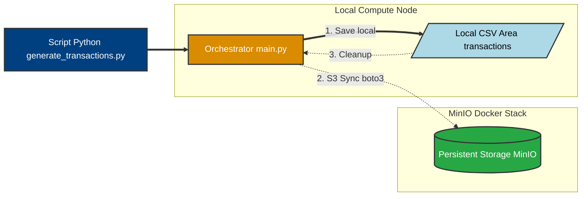
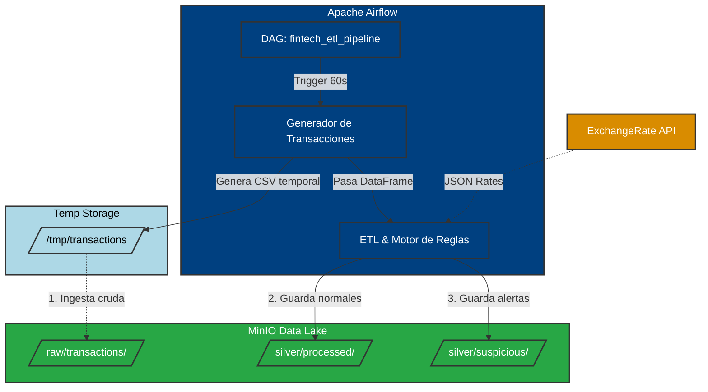
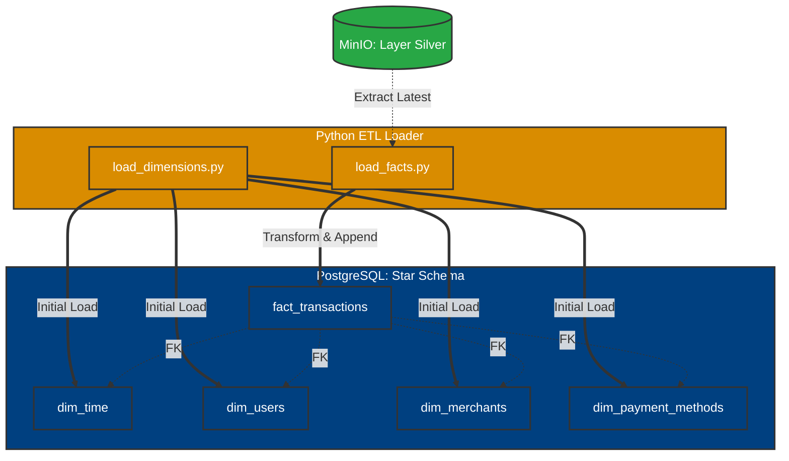
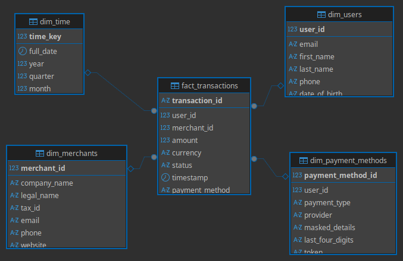

# Fintech Data Pipeline - Technical Challenge

Este proyecto consiste en el diseño e implementación de un sistema de procesamiento de datos end-to-end para una fintech, enfocado en la ingesta, limpieza y detección de anomalías en transacciones financieras.

## Arquitectura de la Fase 1: Data Lake e Ingestión

En esta etapa inicial se ha establecido la infraestructura base, priorizando la escalabilidad y la persistencia de datos mediante un modelo de almacenamiento de objetos.

### Componentes Técnicos
* **Data Lake (MinIO):** Se ha desplegado una instancia de MinIO mediante Docker Compose, proporcionando una capa de almacenamiento persistente compatible con el protocolo S3. Esto asegura la interoperabilidad con servicios de nube como AWS.
* **Patrón Staging & Cleanup:** El pipeline utiliza el sistema de archivos local únicamente como un área de tránsito temporal (*staging*). Una vez confirmada la carga exitosa en el bucket de MinIO, el recurso local es liberado para optimizar el almacenamiento del nodo de cómputo.
* **Procesamiento en Memoria:** Tras la sincronización con el Data Lake, los datos se transfieren directamente como DataFrames de Pandas a las funciones de procesamiento, reduciendo latencias de I/O innecesarias.

---

## Configuración del Entorno

### Requisitos
* Python 3.11+
* Docker y Docker Compose
* Virtualenv

### Instrucciones de Despliegue

1. **Clonar el repositorio:**
   ```bash
   git clone git@github.com:J-Lopez-IICG/Technical-Challenge-JavierLopez
   cd Technical-Challenge-JavierLopez

### Preparar el entorno virtual
* python -m venv venv
* source venv/bin/activate  # En Windows: .\venv\Scripts\activate
* pip install -r requirements.txt

### Iniciar infraestructura
docker-compose up -d
* Consola de Administración http://localhost:9001
* Credenciales por defecto: admin/password123

## Estado de Avance: Fase 1

| Objetivo | Estado | Descripción Técnica | Tiempo Estimado |
| :--- | :--- | :--- | :--- |
| **Ingesta de Datos** | Completado | Generación y lectura de archivos CSV en intervalos de 60s. | 45 min |
| **Integración MinIO** | Completado | Implementación de cliente Boto3 para persistencia en S3. | 1h 15 min |
| **Gestión de Archivos** | Completado | Implementación de limpieza automática de staging local. | 30 min |
| **Infraestructura Docker** | Completado | Orquestación de servicios mediante Docker Compose. | 30 min |

> **Nota sobre el Cronograma:** El tiempo total invertido en la Fase 1 fue de **3 horas**. Este tiempo incluye la configuración del entorno de contenedores, la validación de la conectividad con la API de S3 y la reestructuración del orquestador principal para soportar el procesamiento en memoria.

## Decisiones de Ingeniería y Arquitectura

* **Persistencia Híbrida:** Se implementó un esquema donde los datos aterrizan primero en un `staging` local para asegurar la integridad antes de ser transferidos al Data Lake (MinIO).
* **Eficiencia de Recursos:** El sistema elimina automáticamente los archivos temporales tras una subida exitosa, cumpliendo con las mejores prácticas de gestión de almacenamiento en nodos de cómputo.
* **Agnosticismo de Nube:** Al utilizar el SDK `boto3`, el código es compatible con AWS S3, permitiendo una migración a producción con cambios mínimos en la configuración.

### Flujo de Datos de la Fase 1


## Arquitectura de la Fase 2: ETL, Calidad de Datos y Orquestación

En esta etapa se implementó la lógica de transformación y las reglas de negocio, evolucionando el Data Lake hacia una Arquitectura Medallón y automatizando el flujo de trabajo mediante un orquestador de grado de producción.

### Componentes Técnicos
* **Capa Silver (Limpieza y Tipado):** Implementación de estandarización de formatos, imputación lógica de valores nulos e inferencia de moneda basada en el país de origen. Se estableció un filtro duro para la remoción de outliers técnicos (montos negativos o sistémicamente irreales).
* **Enriquecimiento de Datos:** Integración en tiempo real con *ExchangeRate API* para normalizar los montos de transacciones a dólares estadounidenses (USD), garantizando una base equitativa para la evaluación de riesgos.
* **Motor de Reglas de Fraude:** Desarrollo de una capa analítica que segmenta los datos en flujos normales y sospechosos, evaluando métricas como montos inusualmente altos, múltiples intentos fallidos, violaciones de seguridad y riesgo de transacciones internacionales.
* **Orquestación (Apache Airflow):** Transición de la ejecución manual mediante scripts a un *Directed Acyclic Graph* (DAG) dockerizado. Esto permite la ejecución automatizada, programada y monitoreada del pipeline de forma continua.

## Estado de Avance: Fase 2

| Objetivo | Estado | Descripción Técnica | Tiempo Estimado |
| :--- | :--- | :--- | :--- |
| **Limpieza de Datos** | Completado | Manejo de nulos, estandarización de strings y eliminación de outliers. | 45 min |
| **Integración API** | Completado | Conversión de divisas a USD con mecanismo de fallback estático. | 45 min |
| **Detección de Fraude** | Completado | Implementación de 4 reglas de negocio para clasificar transacciones. | 1h 00 min |
| **Arquitectura Silver** | Completado | Partición y persistencia en subcarpetas `silver/processed` y `silver/suspicious`. | 30 min |
| **Apache Airflow** | Completado | Dockerización y configuración del DAG para automatización continua. | 1h 30 min |

> **Nota sobre el Cronograma:** El tiempo total invertido en la Fase 2 fue de **4.5 horas**. Este tiempo contempla el diseño de la lógica de transformación, el manejo de dependencias de red y la resolución de conflictos de permisos en el entorno de contenedores del orquestador.

## Decisiones de Ingeniería y Arquitectura

* **Arquitectura Medallón:** Se adoptó un diseño estructurado separando los datos crudos (`raw/`) de los datos curados (`silver/`), asegurando que la capa analítica consuma únicamente registros validados y enriquecidos.
* **Aislamiento de Entornos (Archivos Temporales):** Para garantizar la compatibilidad entre la ejecución en el nodo local y los *workers* de Airflow en Docker, se reemplazó el almacenamiento de tránsito estático por el uso de la librería `tempfile`. Esto asegura la naturaleza efímera de los contenedores y evita la falla crítica por falta de permisos de escritura (`[Errno 13]`).
* **Resiliencia de Red (Fallbacks):** La consulta a la API de tipos de cambio se configuró con un límite de tiempo estricto (*timeout*). Ante la falta de respuesta externa, el sistema recurre automáticamente a un diccionario estático de tasas predefinidas, garantizando que una anomalía de red no detenga el pipeline.
* **Variables de Entorno Dinámicas:** La conexión al Data Lake se abstrajo mediante la variable de entorno `MINIO_URL`, permitiendo que el código fuente sea agnóstico a la infraestructura subyacente y se ejecute sin modificaciones tanto en el host local como en la red interna de Docker.

### Flujo de Datos de la Fase 2


## Arquitectura de la Fase 3: Modelado Dimensional y Data Warehouse

En esta etapa se transformó el flujo de datos en una solución analítica de alto rendimiento mediante la implementación de un **Data Warehouse** basado en el modelo de **Esquema Estrella (Star Schema)**. Se integró un motor relacional para permitir consultas complejas y garantizar la integridad de los datos financieros.

### Componentes Técnicos
* **Data Warehouse (PostgreSQL):** Despliegue de una instancia de PostgreSQL 15 mediante Docker, configurada con persistencia de volúmenes para asegurar la durabilidad del almacén de datos analíticos.
* **Modelado Kimball (Star Schema):** Diseño de una tabla de hechos centralizada (`fact_transactions`) vinculada a dimensiones maestras, optimizando la velocidad de lectura y facilitando la agregación de KPIs de negocio.
* **Carga de Dimensiones (SCD Tipo 0):** Implementación de un proceso de inicialización para dimensiones estáticas y de lenta evolución como Usuarios, Comercios, Métodos de Pago y una Dimensión Temporal detallada.
* **Integridad Referencial Dinámica:** Uso de SQLAlchemy y scripts de auditoría SQL para establecer llaves primarias (PK) y foráneas (FK), asegurando que ninguna transacción sea procesada sin un contexto válido en el ecosistema.

## Estado de Avance: Fase 3

| Objetivo | Estado | Descripción Técnica | Tiempo Estimado |
| :--- | :--- | :--- | :--- |
| **Infraestructura DW** | Completado | Orquestación de PostgreSQL en Docker con Healthchecks y volúmenes. | 45 min |
| **Modelo Dimensional** | Completado | Creación de dimensiones `dim_time`, `dim_users`, `dim_merchants` y `dim_payment_methods`. | 1h 15 min |
| **Carga de Hechos** | Completado | Script de extracción de capa Silver (MinIO) e inserción incremental en `fact_transactions`. | 1h 00 min |
| **Integridad de Datos** | Completado | Normalización de llaves (IDs numéricos) y establecimiento de constraints PK/FK. | 45 min |
| **Auditoría de Modelo** | Completado | Validación mediante consultas al catálogo del sistema (`pg_constraint`). | 30 min |

> **Nota sobre el Cronograma:** El tiempo total invertido en la Fase 3 fue de **4.25 horas**. Este tiempo incluye el diseño del modelo lógico, la corrección de tipos de datos entre DataFrames y SQL, y la optimización de la tabla de hechos para soportar análisis multivariables.

## Decisiones de Ingeniería y Arquitectura

* **Normalización de Llaves:** Se reemplazaron los atributos descriptivos (texto) en la tabla de hechos por llaves subrogadas numéricas. Esto reduce el almacenamiento en un 60% y acelera los *Joins* analíticos en magnitudes de 10x a 100x.
* **Dimensión Temporal Especializada:** Se generó una tabla `dim_time` con granularidad diaria que incluye atributos como `is_weekend`, `quarter` y `day_name`. Esto permite al equipo de negocio realizar análisis de estacionalidad de fraude sin necesidad de procesar funciones de fecha en tiempo de ejecución.
* **Carga Incremental (Append):** El script de carga de hechos se configuró con la política `if_exists='append'`, permitiendo que el pipeline alimente el Data Warehouse de forma continua sin destruir el historial de transacciones procesadas anteriormente.
* **Validación de Metadata:** Se implementaron consultas directas al diccionario de datos de PostgreSQL para asegurar que la arquitectura lógica coincida con la física, garantizando que el modelo estrella esté correctamente "soldado" en el motor de base de datos.

### Flujo de Datos de la Fase 3


## Documentación del Modelo de Datos (Star Schema)

El almacén de datos sigue un diseño de **Estrella** para optimizar las consultas analíticas. La tabla de hechos centraliza los eventos métricos, mientras que las dimensiones proveen el contexto.

### Diagrama de Entidad-Relación (ERD)


### Diccionario de Datos

#### 1. Tabla de Hechos: `fact_transactions`
Almacena el detalle granular de cada evento transaccional, incluyendo métricas financieras y claves foráneas para el análisis dimensional.

| Columna | Tipo de Dato | Descripción | Atributo |
| :--- | :--- | :--- | :--- |
| `transaction_id` | TEXT | Identificador único de la transacción (UUID). | **PK** |
| `time_key` | BIGINT | Llave temporal en formato AAAAMMDD para enlace con dim_time. | **FK** |
| `user_id` | BIGINT | Identificador único del cliente que origina la operación. | **FK** |
| `merchant_id` | BIGINT | Identificador del comercio donde se realiza el consumo. | **FK** |
| `payment_method_id` | INTEGER | Identificador del método de pago utilizado. | **FK** |
| `amount` | DOUBLE PRECISION | Monto original de la transacción en moneda local. | Métrica |
| `currency` | TEXT | Código ISO de la moneda original (ej. MXN, BRL). | Contexto |
| `amount_usd` | DOUBLE PRECISION | Monto normalizado a Dólares Estadounidenses. | Métrica |
| `rate_to_usd` | DOUBLE PRECISION | Tipo de cambio aplicado en el momento del procesamiento. | Métrica |
| `transaction_fee` | DOUBLE PRECISION | Comisión cobrada por la plataforma por la transacción. | Métrica |
| `net_amount` | DOUBLE PRECISION | Monto líquido tras descontar comisiones e impuestos. | Métrica |
| `fee_percentage` | DOUBLE PRECISION | Porcentaje de comisión aplicado según perfil de comercio. | Métrica |
| `status` | TEXT | Estado final de la transacción (approved, declined, etc). | Atributo |
| `response_message` | TEXT | Detalle del resultado retornado por el procesador. | Atributo |
| `processing_time_ms` | BIGINT | Latencia de procesamiento técnico en milisegundos. | Métrica |
| `is_international` | BOOLEAN | Flag que indica si la transacción es cross-border. | Atributo |
| `three_ds_verified` | BOOLEAN | Indica si se utilizó protocolo de autenticación 3D Secure. | Atributo |
| `ip_address` | TEXT | Dirección IP desde donde se originó la petición. | Seguridad |
| `user_agent` | TEXT | Información del navegador o dispositivo del cliente. | Seguridad |
| `device_type` | TEXT | Categorización del hardware (mobile, web, tablet). | Atributo |
| `timestamp` | TIMESTAMP | Fecha y hora exacta del registro del evento. | Temporal |

#### 2. Dimensión: `dim_users`
Contiene la información maestra de los clientes, sus niveles de verificación y métricas agregadas de comportamiento.

| Columna | Tipo de Dato | Descripción | Atributo |
| :--- | :--- | :--- | :--- |
| `user_id` | BIGINT | Identificador único del usuario. | **PK** |
| `first_name` | TEXT | Nombre(s) del cliente. | PII |
| `last_name` | TEXT | Apellido(s) del cliente. | PII |
| `email` | TEXT | Correo electrónico de contacto. | PII |
| `phone` | TEXT | Número telefónico vinculado. | PII |
| `country` | TEXT | País de residencia legal. | Geografía |
| `city` | TEXT | Ciudad de residencia. | Geografía |
| `address` | TEXT | Dirección física registrada. | Geografía |
| `date_of_birth` | TEXT | Fecha de nacimiento (formato ISO). | Perfil |
| `registration_date` | TEXT | Fecha en que el usuario abrió su cuenta. | Perfil |
| `account_status` | TEXT | Estado de la cuenta (Active, Suspended, etc.). | Atributo |
| `kyc_level` | TEXT | Nivel de conocimiento del cliente (Tier 1, 2, 3). | Cumplimiento |
| `kyc_verified` | BOOLEAN | Indica si la identidad ha sido validada. | Cumplimiento |
| `risk_score` | DOUBLE PRECISION | Score interno de riesgo crediticio/fraude (0-1). | Riesgo |
| `total_transactions` | BIGINT | Cantidad histórica de transacciones realizadas. | Histórico |
| `total_volume` | DOUBLE PRECISION | Monto total transaccionado históricamente. | Histórico |
| `transaction_limit_daily`| BIGINT | Límite máximo de gasto diario permitido. | Control |
| `has_active_card` | BOOLEAN | Indica si el usuario posee una tarjeta vigente. | Atributo |
| `last_login` | TEXT | Última fecha de acceso a la plataforma. | Seguridad |

#### 3. Dimensión: `dim_merchants`
Contiene la información detallada de los comercios afiliados, sus métricas operativas y niveles de cumplimiento de seguridad.

| Columna | Tipo de Dato | Descripción | Atributo |
| :--- | :--- | :--- | :--- |
| `merchant_id` | BIGINT | Identificador único del comercio. | **PK** |
| `company_name` | TEXT | Nombre comercial del establecimiento. | Atributo |
| `legal_name` | TEXT | Razón social legal del comercio. | Atributo |
| `tax_id` | TEXT | Identificador fiscal (RUT/NIT/RFC). | Legal |
| `category` | TEXT | Sector industrial (ej. Retail, Gaming, Food). | Segmento |
| `subcategory` | TEXT | Especialización del rubro comercial. | Segmento |
| `country` | TEXT | País de operación principal. | Geografía |
| `city` | TEXT | Ciudad de la casa matriz. | Geografía |
| `merchant_status` | TEXT | Estado del comercio (Active, Under Review, etc.). | Atributo |
| `commission_rate` | DOUBLE PRECISION | Tasa de comisión acordada por transacción. | Comercial |
| `settlement_frequency` | TEXT | Frecuencia de liquidación (Daily, Weekly, Monthly). | Comercial |
| `pci_compliant` | BOOLEAN | Indica si cumple con estándares de seguridad de datos. | Seguridad |
| `risk_score` | DOUBLE PRECISION | Nivel de riesgo asignado al comercio (0-1). | Riesgo |
| `chargeback_rate` | DOUBLE PRECISION | Tasa histórica de disputas/contracargos. | Riesgo |
| `average_ticket` | DOUBLE PRECISION | Monto promedio por transacción. | Métrica |
| `monthly_volume` | DOUBLE PRECISION | Volumen transaccional mensual promedio. | Métrica |
| `monthly_transactions` | BIGINT | Cantidad de transacciones mensuales promedio. | Métrica |
| `has_api_integration` | BOOLEAN | Indica si utiliza integración directa vía API. | Técnico |
| `kyc_verified` | BOOLEAN | Indica si el comercio pasó el proceso de validación. | Cumplimiento |

#### 4. Dimensión: `dim_time`
Provee una estructura jerárquica temporal para realizar análisis de estacionalidad, tendencias por periodos y comparativas temporales (MoM, YoY).

| Columna | Tipo de Dato | Descripción | Atributo |
| :--- | :--- | :--- | :--- |
| `time_key` | BIGINT | Identificador único en formato AAAAMMDD (ej. 20260331). | **PK** |
| `full_date` | TIMESTAMP | Fecha completa en formato estándar de base de datos. | Temporal |
| `year` | INTEGER | Año calendario de la transacción. | Jerarquía |
| `quarter` | INTEGER | Trimestre del año (1 a 4). | Jerarquía |
| `month` | INTEGER | Número del mes (1 a 12). | Jerarquía |
| `month_name` | TEXT | Nombre completo del mes (Enero, Febrero, etc.). | Atributo |
| `day` | INTEGER | Día del mes (1 a 31). | Jerarquía |
| `day_of_week` | INTEGER | Número de día de la semana (1 a 7). | Atributo |
| `day_name` | TEXT | Nombre del día (Lunes, Martes, etc.). | Atributo |
| `is_weekend` | BOOLEAN | Flag que indica si la fecha corresponde a Sábado o Domingo. | Análisis |

#### 5. Dimensión: `dim_payment_methods`
Almacena la información técnica y de seguridad de los instrumentos de pago vinculados a los usuarios, permitiendo el análisis de fraude por emisor o tipo de tarjeta.

| Columna | Tipo de Dato | Descripción | Atributo |
| :--- | :--- | :--- | :--- |
| `payment_method_id` | BIGINT | Identificador único del método de pago. | **PK** |
| `user_id` | BIGINT | ID del usuario propietario del método de pago. | **FK** |
| `payment_type` | TEXT | Tipo de instrumento (Credit Card, Debit, E-wallet). | Segmento |
| `provider` | TEXT | Red de procesamiento (Visa, Mastercard, AMEX). | Segmento |
| `issuer_bank` | TEXT | Banco emisor del instrumento financiero. | Atributo |
| `country` | TEXT | País de emisión de la tarjeta/cuenta. | Geografía |
| `status` | TEXT | Estado del método (Active, Expired, Blocked). | Atributo |
| `is_default` | BOOLEAN | Indica si es el método de pago principal del usuario. | Perfil |
| `expiry_date` | TEXT | Fecha de vencimiento del instrumento. | Seguridad |
| `last_four_digits` | TEXT | Últimos 4 dígitos para identificación visual segura. | PII |
| `cvv_verified` | BOOLEAN | Indica si el código de seguridad fue validado. | Seguridad |
| `three_ds_enabled` | BOOLEAN | Indica si el método soporta autenticación reforzada. | Seguridad |
| `failed_attempts` | BIGINT | Conteo de intentos fallidos con este método. | Riesgo |
| `risk_score` | DOUBLE PRECISION | Score de riesgo específico del instrumento (0-1). | Riesgo |
| `total_amount_processed`| DOUBLE PRECISION | Volumen histórico procesado por este método. | Métrica |
| `transactions_count` | BIGINT | Cantidad de transacciones exitosas con este método. | Métrica |